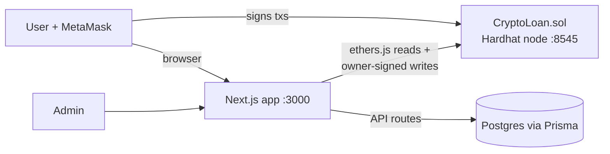

# CryptoLend — System Overview

A crypto-backed lending platform: users deposit **ETH as collateral** and borrow **MYR** (a mock Malaysian Ringgit stablecoin) against it, Nexo-style. The repo is two independent npm projects:

```
crypto-loan/
├── blockchain/   Solidity contracts + Hardhat (deploy, test, verify)
└── web/          Next.js app — frontend, API routes, Prisma/Postgres
```

## High-level architecture



- **On-chain** is the source of truth for money: collateral, debt, interest, liquidation, the ETH/MYR price, and a per-wallet `kycApproved` flag.
- **Off-chain** (Postgres) is the source of truth for identity: accounts, KYC submissions and documents, bank accounts/transfers, feature flags, and the admin audit log.
- The web app bridges the two: users sign their own transactions with MetaMask; the server (holding the contract owner key) performs owner-only calls like `setKYC` and price updates.

## Smart contracts (`blockchain/contracts/`)

**`CryptoLoan.sol`** — the core protocol. Key parameters: **70% max LTV**, **80% liquidation threshold**, **5% liquidator bonus**, **4.8% APR** interest (accrued linearly since last repayment). It deploys its own `MockMYR` token and holds the ETH/MYR price on-chain (owner-updated, sanity-capped at ±20% per move).

| Function | Who | What |
|---|---|---|
| `depositCollateral()` | anyone | Send ETH, credited as collateral |
| `borrow(myr)` | KYC-flagged wallets | Mints MYR up to 70% of collateral value |
| `repay(myr)` | borrower | Pulls approved MYR; interest first, then principal |
| `withdrawCollateral(wei)` | borrower | Allowed only if remaining position stays under max LTV |
| `buyMYR(myr)` | anyone | Swap ETH → MYR at the on-chain price (to top up for repayment) |
| `liquidate(borrower, debt)` | whitelisted liquidators | When health factor < 1: repay debt, seize collateral + 5% bonus |
| `setKYC`, `setEthPrice`, `pause`, `withdrawProtocolFees` | owner | Admin/ops |

**Health factor** = (collateral value × 80%) / debt. Below 1.0 the position is liquidatable.

Also present: `MockMYR.sol` (6-decimal ERC-20 minted by the loan contract), `ICO.sol` + `RinggitToken.sol`/`MockUSDC.sol` (separate token-sale demo behind the `/ico` page).

Deploying (`npm run deploy:local`) writes addresses + ABIs into `web/src/lib/contractConfig.ts`, which the frontend imports directly — no manual address wiring.

## Web app (`web/`)

Next.js (App Router) + MUI, dark navy theme for the signed-in app, light theme for marketing/auth pages.

### Auth
- Email/password **or** wallet-based signup/login (`/api/auth/*`). Wallet login proves ownership by signing a server-issued nonce (`wallet-nonce` → `personal_sign` → `wallet-login`).
- Session = JWT cookie (~7 days). `authz.ts` re-reads the live user row on every API call, so suspensions/demotions take effect immediately; `sessionEpoch` on the user invalidates all outstanding JWTs (e.g. password reset).
- Users can be `ACTIVE` or `RESTRICTED` (read-only — every write refused off-chain; note they could still hit the contract directly from their own wallet).

### KYC + wallet model (account-centric)
- **KYC belongs to the account, not the wallet**: one `KycSubmission` per `userId`; the `wallet` column is only the on-chain anchor and is cleared on unlink. Documents (IC front/back, selfie) are stored in-DB as data URIs and served via `GET /api/kyc/documents`.
- **Connect = Link**: clicking Connect opens the MetaMask picker, refuses wallets owned by another account, proves ownership via signature, links the wallet, and — if the account is entitled (KYC approved **or** admin) — grants the contract's `setKYC` flag server-side.
- **Admins bypass KYC** everywhere (UI and on-chain grant at link time).
- **Unlink is self-service**, blocked only by an active on-chain position or it being the account's last sign-in method. The on-chain flag lifecycle fails closed: a freed wallet never keeps its KYC flag.
- Admin KYC review lives at `/admin/kyc` (approve/reject → server calls `setKYC`), with a one-click **“Re-sync all on-chain”** (`POST /api/kyc/resync`) to reconcile DB entitlement with contract flags.

Happy path: **signup → submit KYC (no wallet needed) → admin approves → one-click wallet link → deposit & borrow.**

### Main screens (`app/(screen)/`)
- **`dashboard`** — the core loan UI: markets table plus the **Manage Position** modal (Deposit / Withdraw / Borrow / Repay / Buy MYR tabs, live LTV & health-factor math, inline transaction-status banner + global `TxToast`).
- **`portfolio`** — personal position and transaction history; **`markets`** — rates/calculator; **`explorer`** — public on-chain tx explorer; **`docs`**, **`kyc`**, **`settings`** (account & sign-in self-service, bank account, wallet link/unlink).
- **`admin/*`** — users (restrict/delete), KYC review, transactions, feature flags, and an append-only **audit log** of every admin mutation.

All transaction flows run through `lib/WalletContext.tsx`, which owns the MetaMask connection, enforces "connected account == linked wallet", and drives the pending/success/error toast state.

### API routes (`app/api/`)
`auth/*` (signup, login, logout, me, wallet-nonce, wallet-login) · `kyc/*` (submit, approve, documents, resync) · `wallet/link|unlink` · `profile/account|bank-account` · `transfers` (off-chain MYR → bank payout records) · `loan-tx` (indexes on-chain events into `LoanTransaction`) · `prices` / `sync-price` (pushes a fresh ETH price to the contract via the owner key) · `explorer` · `admin/*` (users, features, transactions, audit, price sync) · `features` (public flag map).

### Feature flags
`lib/features.ts` declares a registry (loan actions, pages, signup/login, site-wide maintenance); `FeatureFlag` rows in the DB are admin overrides — `ON`, `MAINTENANCE` (visible but blocked), or `HIDDEN`. Empty table = everything on. Server-side `featureBlocked()` enforces flags on APIs; the UI shows maintenance dialogs. Admin sign-in can never be locked out.

## Data model (Prisma / Postgres)

| Model | Purpose |
|---|---|
| `User` | Account: email/password and/or wallet, `isAdmin`, `status` (ACTIVE/RESTRICTED), `sessionEpoch` |
| `KycSubmission` | One per user; personal details + document images; `status` pending/approved/rejected; optional `wallet` anchor |
| `BankAccount` / `BankTransfer` | Registered payout account and off-chain MYR transfer records |
| `LoanTransaction` | Indexed on-chain events (deposit/borrow/repay/…) keyed by wallet + txHash |
| `FeatureFlag` | Admin overrides over the feature registry |
| `AdminAuditLog` | Append-only record of every admin mutation |

## Running locally (short version)

```bash
# Terminal A            # Terminal B                   # Terminal C
cd blockchain           cd blockchain                  cd web
npm run chain           npm run deploy:local           npm run dev
```

MetaMask: add network `http://127.0.0.1:8545`, chain ID `31337`, import a Hardhat key. Postgres via `DATABASE_URL` (`.env` in both repo root and `web/`); `npx prisma migrate deploy` applies migrations. Restarting the Hardhat node requires a redeploy. See `README.md` for full setup, env vars, and Sepolia/mainnet deploys.
